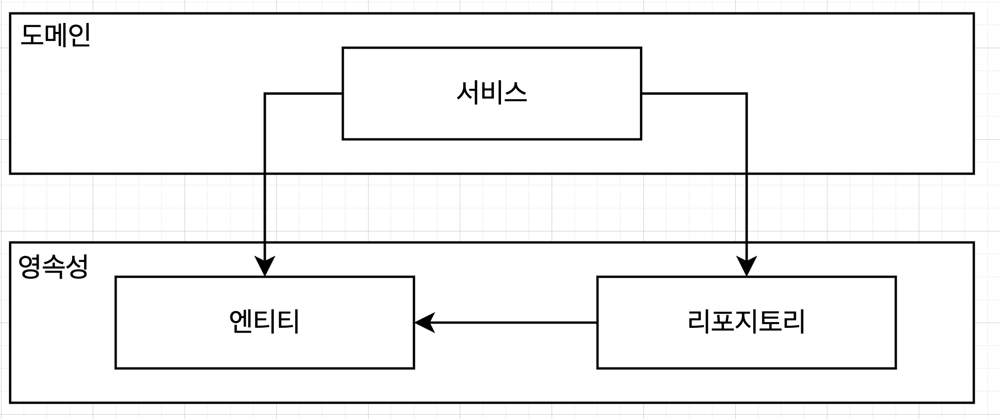
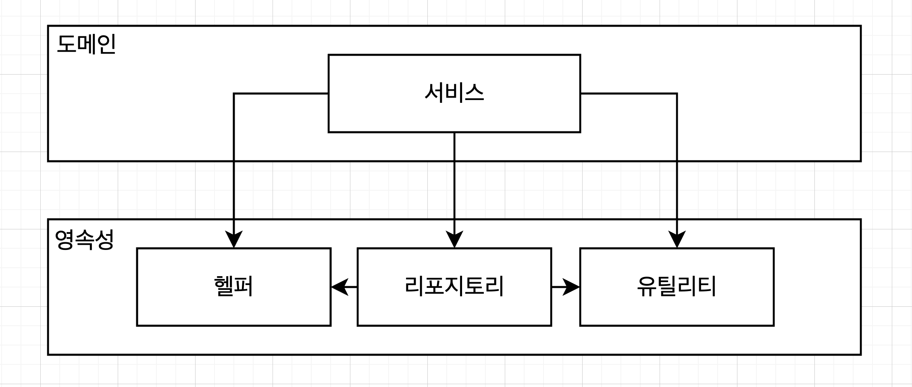

# 계층형 아키텍처의 문제는 무엇일까?

## 계층형 아키텍처는 데이터베이스 주도 설계를 유도한다

* 정의에 따르면 전통적인 계층형 아키텍처의 토대는 데이터베이스
* 웹 계층은 도메인 계층을 의존, 도메인 계층은 영속성 계층을 의존하기 때문에 자연스럽게 데이터베이스에 의존하게 됨
* 이처럼 영속석 계층을 토대로 만들어지면 다양항 문제를 초래하게 됨

* 어플리케이션의 목적이 무엇인지 생각해봐야 함
  * 비즈니스 규칙 또는 정책을 반영한 모델을 만들어서 사용자가 이러한 규칙과 정책을 편리하게 활용할 수 있어야함
  * 이때 상태(state)가 아닌 행동(behavior)을 중심으로 모델링 해야함
    * 행동이 상태를 바꾸는 주체이기 때문
  * 그런데 왜 도메인 로직이 아닌 데이터베이스를 토대로 아키텍처를 만들까?
    * 그 이유는 데이터베이스 구조를 먼저 설계하고 도메인 로직을 구현했기 때문
    * 이는 계층형 아키텍처에서는 (의존성 방향으로 인해) 합리적인 방법
* 데이터베이스 중심적인 아키텍처가 만들어지는 가장 큰이유는 ORM 프레임워크를 사용하기 때문
  * 계층형 아키텍처 + ORM 프레임워크의 결합으로 인해 비즈니스 규칙을 영속성 관점과 섞고 싶은 유혹을 쉽게 받음
  * 엔티티를 영속성 계층에 두기 때문에 영속성 계층과 도메인 계층간의 강한 결합이 발생
  * 서비스는 영속성 모델을 비즈니스 모델처럼 사용하게 됨
    * 즉시로딩, 지연로딩, 트랜젝션, 캐시등 영속성 계층과 관련된 작업을 수행
* 이처럼 영속성 계층이 도메인 계층에 녹아들면 둘중 하나만 변경하는 것이 어렵게 됨  

## 지름길을 택하기 쉬워진다

* 전통적인 계층청 아키텍처에서 통용되는 유일한 규칙은, 특정 계층에서는 같은 또는 낮은 계층의 컴포넌트만 접근 가능하다는 것
* 따라서 상위 계층에 위치한 컴포넌틍 접근해야 한다면 접근할 상위 계층을 한단계 낮은 계층으로 내리면됨
  * 처음은 어렵지만 한번 하면 그 다음부터는 심리적 죄책감이 덜함 (이를 깨진 창문 이론이라고 함)
* 유지보수를 진행 할 수록 점점 다음과 같아짐
  * 어떤 계층도 속하지 않는 것 처럼 보이는 헬퍼, 유틸리티 등으로 변동됨

## 테스트하기 어려워진다

* 두 가지 문제가 생김
  1. 도메인 계층을 웹 계층에 구현하게 됨
  2. 웹 계층 테스트에서 도메인 계층 뿐만 아니라 영속성 계층도 목킹해야함

## 유스케이스를 숨긴다

* 개발자는 새로운 유스케이스를 구현하는 새로운 코드를 짜는 것을 선호
  * 그러나 기존 코드를 바꾸는데 더 많은 시간을 씀
* 기능을 추가하거나 변경할때 적절한 위치를 찾는 일은 빈번하게 발생
  * 즉 아키텍처는 코드를 빠르게 탐색하는데 도움이 되어야함
  * 이러한 관점에서 계층형 아키텍처의 문제점은?
    * 도메인 로직이 여러 계층에 흩어지기 쉬움
  * 또한 계층현 아키텍처는 도메인 서비스의 넓이에 대한 제약이 없음
    * 다음과 같이 여러개의 유스케이스를 담당하는 넓은 서비스가 만들어지기도 함
    * 좁은 도메인 서비스가 유스케이스 하나씩만 담당한다면?
    * UserService에서 사용자 등록 유스케이스를 찾는 것이 아닌 RegisterUserService를 열어서 바로 작업을 시작하는 것처럼!

## 동시 작업이 어려워진다

* 정해진 날짜에 맞춰 소프트웨어를 개발하기 위해서는 여러 작업이 동시에 진행되야함
* 50명 규모의 개발팀이 10명 규모의 개발팀보다 개발속도가 5배 빠를거라고 기대할 수는 없음
  * 여러 하위팀으로 쪼개서 각기 분리된 파트를 개발하는 경우에는 그럴 수 있지만 대부분 서로 도움을 주고 받아야함
* 이러한 상황에서 개발생산성을 위해서는 아키텍처가 동시 작업을 지원해야하지만 계층형 아키텍처에서는 이런 측면이 그다지 도움이 되지 않음
* 3명의 개발자가 있는 상황에서 새로운 유스케이스를 추가한다고 가정해보자
  * 한명은 웹 계층, 한명은 도메인 계층, 한명은 영속성 계층에 작업이 가능할까? 그리고 이렇게 하는게 맞을까?
  * 계층형 아키텍처에서는 영속성 계층위에 만들어지기 때문에 영속성이 먼저 작업되고, 도메인 계층, 웹 계층 구현이 가능함
  * 인터페이스를 먼저 같이 정의하고 각 개발자들이 기다리지 않고 작업할 수도 있지만 데이터베이스 주도 설계를 하지 않은 경우에만 가능(이는 영속성 로직과 도메인 로직이 너무 뒤섞여서 각 측면을 개별적으로 작업할 수 없기 때문에)
* 넓은 서비스가 존재하면 서로 다른 기능을 작업하기 어려움
  * 같은 기능을 여러명에서 불필요하게 만들 수도 있고 코드의 병합 충돌 가능성이 존재

## 유지보수 가능한 소프트웨어를 만드는데 어떻게 도움이 될까?

* 
* 