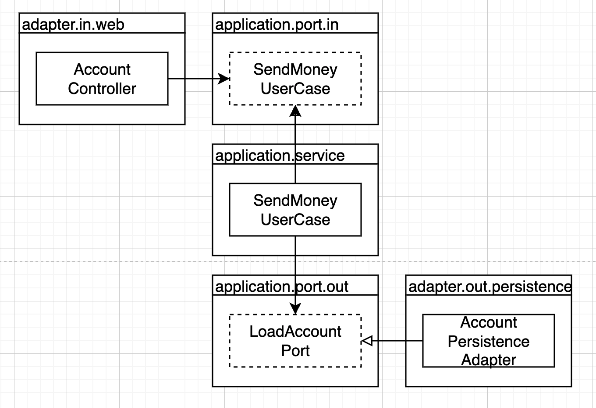

# 코드 구성하기

* 코드를 보는 것만으로도 어떤 아키텍처인지 파악이 가능하면 좋음
* 어번 장에서는 코드를 구성하는 몇가지 방법과 육각형 아키텍처를 직접적으로 반영하는 패키지 구조를 알아봄

## 계층으로 구성하기

```
buckpal
├── domain
│   ├── Account    
│   ├── Activity
│   ├── AccountRepository
│   └── AccountService
├── percistence
│   └── AccountRepositoryImpl
└── web
    └── AccountController
```

* 
* 적어도 세 가지 이유로 최적의 구조가 아님
  1. 애플리케이션의 기능 조작이나 특정을 구분 짓는 패키지 경계가 없음
    * 사용자를 관리하는 기능이 필요하면 web - UserController, domain - User, UserService, UserRepository, persistence - UserRepositoryImpl를 추가 하게 됨
    * 서로 연관되지 않은 클래스들이 함께 구성되면서 예상하지 못한 사이드이팩트 발생가능
  2. 애플리케이션이 어떤 유스케이스들을 제공하는지 파악할 수 없음
    * AccountSerivce, AccountController를 직접 확인해야함
  3. 패키지 구조로 우리가 목표로하는 아키텍처를 파악할 수 없음
    * 특정 아키텍처를 따랐다고 문서 또는 말로 듣고 인지할 수는 있지만 세부적으로 파악할려면 코드를 직접 확인해야함
    * 육각형 아키텍처라면 어떤 기능이 웹 어댑터에서 호출되는지, 영속성 어댑터가 도메인 계층에 기능을 제공하는지 알 수 없음 - 인커밍 포트와 아웃고잉 포트가 코드속에 숨겨져 있음

## 기능으로 구성하기

```
buckpal
└── account
    ├── Account    
    ├── AccountRepository
    ├── AccountRepositoryImpl
    └── AccountService
```

* 계좌와 관련된 모든 코드가 최상위 패키지에 존재
* 기능에 의한 패키징은 계층에 의한 패키징 방식 보다 가시성을 훨씬 떨어뜨림

## 아키텍처적으로 표현력 있는 패키지 구조

```
buckpal
└── account
    ├── adapter
    │   ├── in
    │   │    └── web
    │   │         └── AccountController
    │   ├── out
    │   │    └── persistence
    │   │         ├── AccountPersistenceAdapter
    │   │         └── SpringDataAccountRepository
    │   └── domain
    │        ├── Account
    │        └── Activity
    └── application
             ├── SendMoneyService
             └── port
                   ├── in
                   |    └── SendMoneyUseCase
                   └── out
                        ├── LoadAccountPort
                        └── UpdateAccountStatePort
```

* 
* 어플리케이션 패키지는 도메인 모델을 둘러싼 서비스 계층을 포함
* SendMoneyService는 인커밍 포트인 SendMoneyUseCase를 구현하고 아웃고잉 포트인 LoadAccountPort와 UpdateAccountStatePort를 사용
* 


## 의존성 주입의 역할

* 클린 아키텍처의 가장 본질적인 요건은 애플리케이션 계층이 인커밍/아웃고잉 어대버에 의존성을 갖지 않는 것
* 



* 

## 유지보수 가능한 소프트웨어를 만드는데 어떻게 도움이 될까?

* 이번 장에서는 실제 코드 구조를 최대한 우리가 목표로 하는 아키텍처에 가깝게 만들어주는 패키지구조를 살펴봄