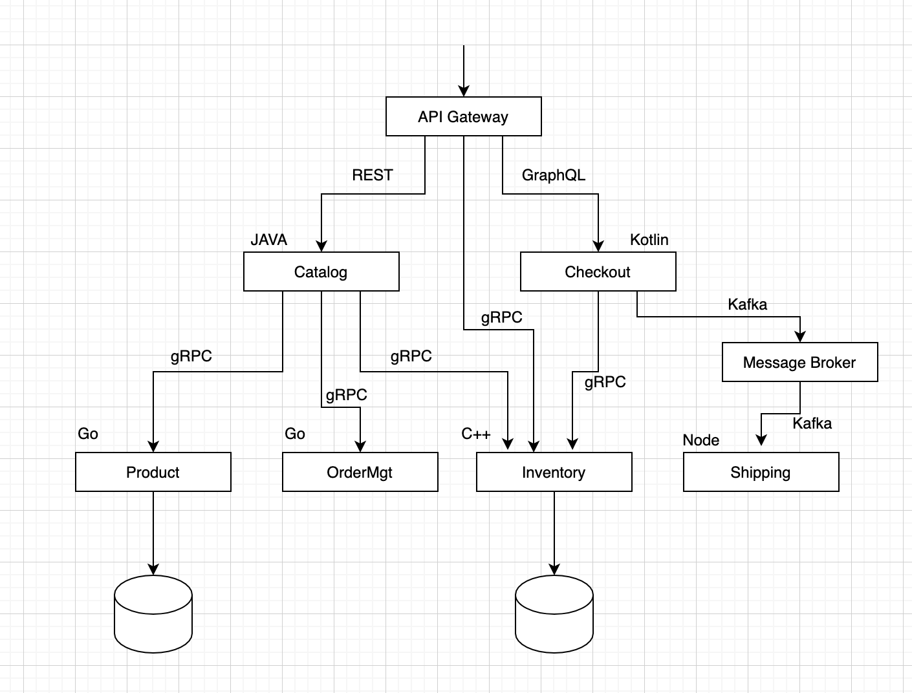

# gRPC 통신 패턴

앞 장에서 클라이언트 서버 기반의 간단한 요청-응답 패턴을 구현하였습니다. 이번장에서는 좀 더 다양한 통신 패턴을 살펴봅니다.

### 4가지의 통신기법
* 단순 RPC (단일 RPC)
* 서버 스트리밍
* 클라이언트 스트리밍
* 양뱡향 스트리밍

### 단순 RPC (단일 RPC)
* **클라이언트**가 **서버**의 원격 기능 호출을 위해 단일 요청을 보내고 단일응답(후행 메타데이터 포함) 을 받는 형식
* 구현하기가 매우 쉬우며 대부분의 프로세스 간 통신 유스케이스에 적합

### 서버 스트리밍
* 서버가 클라이언트의 요청 메시지를 받은 후 **스트림**을 보내는 형식
* 즉 서버가 여러차례로 응답가능, 클라이언트는 여러 응답 메시지를 수신
* 클라이언트는 서버의 응답이 전부 올때까지 대기할 필요 없음

### 클라이언트 스트리밍
* 클라이언트가 여러 메시지를 서버로 보내고 서버는 단일 응답을 클라이언트에게 보내는 형식
* 서버는 클라이언트의 응청이 전부 올때까지 대기할 필요 없음

### 양뱡향 스트리밍
* 클라이언트와 서버가 각각 여러 응답과 요청이 가능한 방식
* 호출은 클라이언트에서 시작
* 유스 케이스
  * 상품 주문에 대한 여러개의 요청이 서버에 전송될 때, 주문을 모아서 클라이언트로 응답가능
  * 이때 배치 사이즈를 지정함으로 서버에서 최대한으로 모을수 있는 요청수를 지정 가능 

### 마이크로서비스 통신을 위한 gRPC
* gRPC의 주요 활용 중 하나는 마이크로서비스와 이들 서비스 간의 통신을 구현하는 것
* 다른 통신 프로토콜과 함께 사용되며 폴리크랏기반으로 구현 됨

* 위 예에서는 내부적으로는 gRCP가 사용되지만 외부 통신을 위해 REST나 GraphQL을 지원
 

## References
* [gRPC 시작에서 운영까지](http://www.kyobobook.co.kr/product/detailViewKor.laf?ejkGb=KOR&mallGb=KOR&barcode=9791161754635&orderClick=LAG&Kc=)