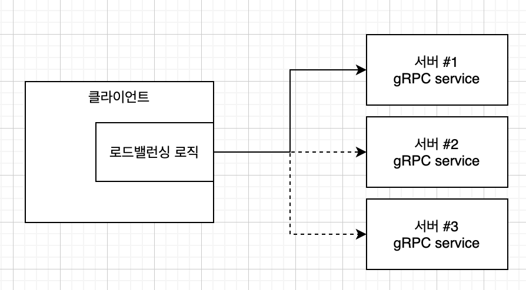

# gRPC 고급 기능

## 인터셉터

* gRPC에서 서버 또는 클라이언트의 동작 수행 전후에 공통적인 로직을 실행할 때 인터셉터를 사용
* 인터셉터를 사용해 로깅, 인증, 메트릭 등과 같은 동작 수행
* gRPC에서는 인터셉터 구현 및 설치를 위해 API를 제공
* 인터셉터는 두 가지 유형으로 분리
  * 단순 RPC의 경우 단일 인터셉터
  * 스트리밍 RPC의 경우 스트리밍 인터셉터

### 서버 측 인터셉터

* 클라이언트가 서버의 원격 메서드 호출 시 실행전 공통 로직 수행
* 

### 클라이언트 측 인터셉터

## 데드라인

* 데드라인과 타임아웃은 분산 컴퓨터에서 일반적으로 사용되는 패턴
* 타임아웃은 RPC가 완료될 때까지 얼마나 기다릴것인지 지정하는 것
  * 기간을 지정
  * 각 클라이언트에 개별 적용
  * 여러 서비스 함께 묶여 실행되는 다운스트림 RPC의 경우 각 서비스 호출마다 개별 RPC적용 가능
  * 묶어서는 불가능
  * 이런경우 데드라인을 사용

* 데드라인은 요청 시작 기준으로 특정 시간으로 표현(기간 오프셋이라도)
* 요청 시작 어플리케이션이 데드라인을 설정하면 전체 요청 체인은 데드라인까지 응답해야함
* gRPC API도 RPC 데드라인 지원
* 여러가지 이유로 항상 데드라인 지정이 바람직함

## 취소 처리

## 에러 처리

## 멀티플렉싱

## 메타데이터

## 로드벨런싱

* 프로덕트 레벨의 gRPC 어플리케이션 개발에 있어서는 고가용성과 확장성을 충족시켜야함
  * 실제 서비스 환경에서 둘 이상의 서버가 실행하는 것
* gRPC에는 두가지 주요 로드밸런싱 메커니즘이 사용 됨
  * 로드밸런서 프록시
  * 클라이언트 측 로드밸런싱

### 로드밸런서 프록시

* 클라이언트가 LB프록시에 RPC를 요청하는 구조
* 이때 사용가능한 백엔드 gRPC 서버중 하나에 RPC호출을 분배
* LB는 프록시는 각 서버의 로드를 추적, 다양한 로드밸런싱 알고리즘을 제공
* 백엔드의 토폴리지는 gRPC 클라이언트에 제공되지 않음
  * 클라이언트는 엔드포인트만 알고있음
* 백엔드는 자신의 상태를 로드밸런서에 알릴 수 있음
* HTTP/2를 지원하는 모든 로드벨런서를 사용가능, 그러나 다음과 같이 명시적으로 지원하는 로드벨런서를 사용하는 것이 좋음
  * 엔진엑스
  * 엔보이 프록시

### 클라이언트 측 로드벨런싱

* 별도의 중간 프록시 계층이 아닌 gRPC 클라이언트 레벨에서 로드밸런싱 로직 구현 가능
* 클라이언트가 여러 백엔드 gRPC 서버를 인식하고 하나를 선택하는 방식
  * 서버를 찾기 위해 질의 할 수 있고 직접 연결
* 클라이언트 애플리케이션의 일부로 개발되거나 룩어사이드 로드밸런서라고 하는 전용서버에서 구현가능

## 압축

* 네크워크 대역폭을 효율적으로 사용하기 위해 클라이언트와 서버 사이의 RPC에서 압축을 사용가능
* 클라이언트가 압축기를 설정해 구현
* 서버는 등록된 압축기가 자동으로 요청에 대한 디코딩 및 응답에 대한 인코딩 수행

## References

* [gRPC 시작에서 운영까지](http://www.kyobobook.co.kr/product/detailViewKor.laf?ejkGb=KOR&mallGb=KOR&barcode=9791161754635&orderClick=LAG&Kc=)